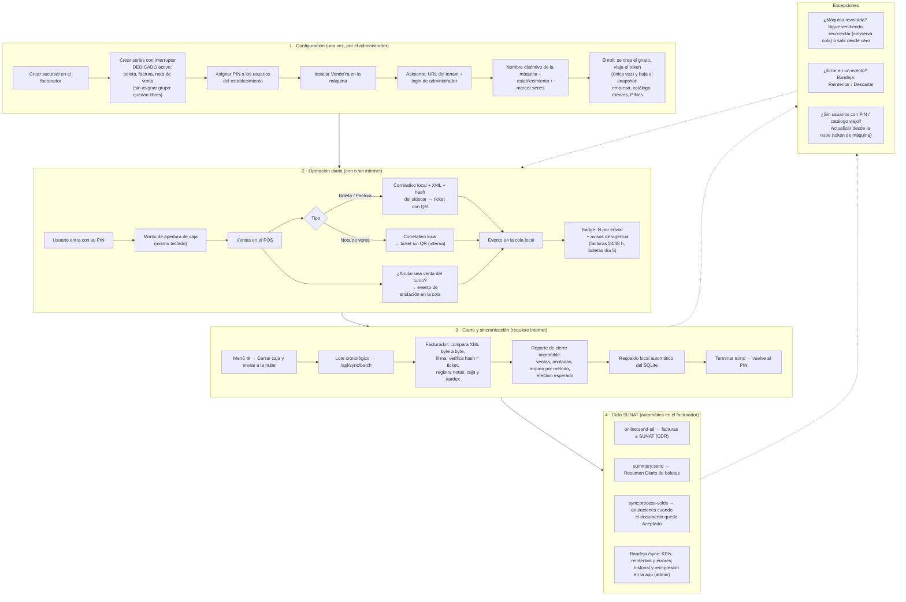

# Módulo Sync — Conexión Offline (VendeYa Escritorio)

Canal de sincronización entre el facturador y las máquinas **VendeYa de
escritorio** (Electron). Permite que un punto de venta emita boletas, facturas
y notas de venta **sin internet** — con numeración propia, QR y hash válidos —
y que todo se registre y firme en el facturador cuando la máquina sincroniza.

Principios de diseño:

- **El certificado digital nunca sale del servidor.** La máquina genera el XML
  sin firmar y su hash (`DigestValue`, que no requiere clave privada); la firma
  ocurre aquí al recibir el lote.
- **Test de contrato vivo:** por cada venta, el facturador re-renderiza el XML
  con sus propias plantillas y lo compara **byte a byte** con el de la máquina
  antes de firmar. Cualquier divergencia cae a la bandeja — jamás se registra
  un documento distinto al ticket impreso.
- **Idempotencia total:** cada evento viaja con un `external_id` (UUID). Un
  lote reenviado (corte de red, reintento) nunca duplica nada.
- **La emisión online del establecimiento se bloquea** mientras tenga máquinas
  activas, para impedir conflictos de numeración (bypass interno para los
  lotes del propio canal).

## De dónde recibe la información

Único cliente: la app **VendeYa** en modo escritorio. Dos credenciales con
alcances distintos:

| Credencial | Se usa en | Alcance |
|---|---|---|
| Bearer de **administrador** (login del tenant) | `enroll-options`, `enroll` | Solo configurar/reconectar una máquina |
| **`X-Machine-Token`** (token de máquina, se entrega UNA vez al enrolar; se guarda hasheado) | `snapshot`, `heartbeat`, `batch` | Operación diaria. No autoriza ningún otro endpoint del API |

Rutas (`Routes/api.php`, prefijo `/api/sync`):

| Método | Ruta | Función |
|---|---|---|
| GET | `enroll-options` | Establecimientos + series dedicadas libres (para el asistente) |
| POST | `enroll` | Registra la máquina, crea su grupo de series y entrega el token |
| GET | `snapshot` | Caché local: empresa/establecimiento completos, series, usuarios con PIN, ítems, clientes |
| POST | `heartbeat` | Vida/estado (aquí la máquina detecta si fue revocada) |
| POST | `batch` | El lote cronológico de eventos del cierre de caja |

## Series: cómo se establecen y sincronizan

Reglas para que una serie sea asignable a una máquina:

1. Se **crea en el facturador** (Sucursales → Series) con el interruptor
   **Dedicado** activo.
2. Debe estar **libre**: sin grupo de dispositivo (`series_device_group_id`
   NULL). **El grupo NO se crea a mano** — lo crea el enrolamiento
   automáticamente (`VendeYa - <máquina>`) con las series que se marquen en el
   asistente.
3. Tipos admitidos: `01` factura, `03` boleta (`07`/`08` previstos) y `80`
   nota de venta (documento interno, sin SUNAT).

Sincronización de numeración:

- Al enrolar, el facturador informa el correlativo inicial (último emitido +1,
  desde `documents` o `sale_notes` según el tipo).
- Desde ahí **el contador local de la máquina es la autoridad**: los snapshots
  posteriores nunca lo pisan. El servidor verifica al recibir cada documento
  que el número registrado sea exactamente el impreso (las notas de venta
  respetan el número de la máquina solo dentro del canal — el flujo online
  sigue asignando último+1).
- Al revocar una máquina, sus series pueden **liberarse** desde el panel para
  reasignarse; el correlativo continúa donde quedó (lo dicta el último
  documento registrado).

## Eventos: procesamiento y tareas programadas

El lote (`batch`) se procesa **en orden cronológico estricto** (`seq`):

| Evento | Qué hace el facturador |
|---|---|
| `cash_open` | Abre la caja del usuario (con su monto inicial) si no tiene una abierta |
| `sale` | Cadena completa del API (`transform → validation → input`), comparación byte a byte, firma, verificación de hash contra el ticket, QR y PDF |
| `sale_note` | Invoca la cadena real de `Api\SaleNoteController@store` (kardex, caja, PDF) respetando el número local; verifica el número registrado |
| `void` | Si el documento ya está **Aceptado**: genera y envía la anulación en el acto (factura → Comunicación de Baja; boleta → resumen `'3'`) y consulta el ticket. Si no: queda `pending` |
| `cash_close` | Cierra la caja del usuario |

Todo evento queda en **`sync_events`** (la bandeja) con su estado:
`accepted`, `pending`, `error` o `discarded`. Las ventas guardan además el XML
de la máquina y el usuario — por eso los errores son **reintentables** desde el
panel con exactamente la misma lógica del lote.

### Tareas programadas (complemento necesario)

El canal registra; el ciclo SUNAT lo completan los crons existentes del
facturador más uno propio del módulo:

| Comando | Rol en el ciclo offline |
|---|---|
| `online:send-all` (existente) | Envía a SUNAT las facturas registradas por los lotes |
| `summary:send` (existente) | Arma el Resumen Diario que informa las boletas de los lotes |
| **`sync:process-voids`** (de este módulo) | Barre las anulaciones `pending` y las materializa en cuanto su documento alcanza el estado Aceptado (regla SUNAT: no se puede dar de baja lo no aceptado; boleta y su anulación van en resúmenes distintos) |

Sin los crons, lo mismo puede completarse a mano: enviar el documento desde su
listado y pulsar **Reintentar** sobre la anulación pendiente en la bandeja. El
KPI **"Pendientes de continuar"** del panel indica cuánto trabajo espera por
estas tareas.

## Panel (Configuración → Conexión Offline VendeYa, ruta `/sync`)

- **Máquinas**: series con su rango emitido (las revocadas muestran su
  histórico reconstruido desde los eventos), contadores, **Revocar** (⊖ — antes
  de hacerlo, la máquina debe cerrar caja y enviar) y **Liberar series** (🔓,
  solo revocadas).
- **Bandeja de eventos**: KPIs (pendientes de continuar / con error /
  aceptados), filtros, **Reintentar** y **Descartar**.

Una máquina revocada no se detiene: sigue vendiendo offline y, al detectar la
revocación (heartbeat/lote), ofrece **reconectar** (token nuevo conservando su
cola — con las mismas series liberadas, los pendientes viajan intactos) o
**salir desde cero** (borra sus datos locales con respaldo previo).

## Flujo funcional completo del usuario



## Estructura del módulo

```
modules/Sync/
├── Http/
│   ├── Controllers/SyncController.php    # enroll-options, enroll, snapshot, heartbeat, batch
│   ├── Controllers/PanelController.php   # panel /sync: máquinas y bandeja
│   └── Middleware/AuthenticateMachine.php# X-Machine-Token (+ código machine_revoked)
├── Services/
│   ├── BatchProcessor.php                # motor del lote y de los reintentos
│   └── VoidProcessor.php                 # materialización de anulaciones (RA / resumen '3')
├── Console/ProcessVoidsCommand.php       # cron sync:process-voids
├── Models/{OfflineMachine, SyncEvent}.php
├── Resources/assets/js/panel/index.vue   # UI del panel (Vite del pro, alias @viewsModuleSync)
├── Resources/views/panel.blade.php
└── Routes/{api, web}.php
```
